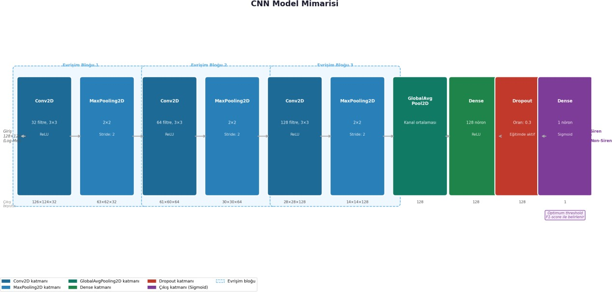
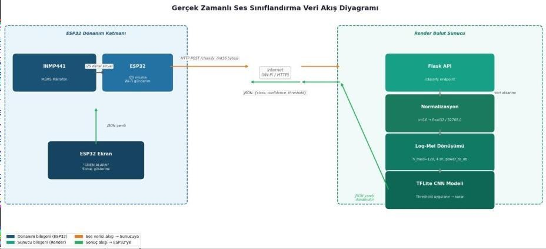
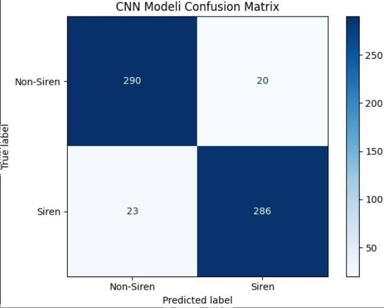
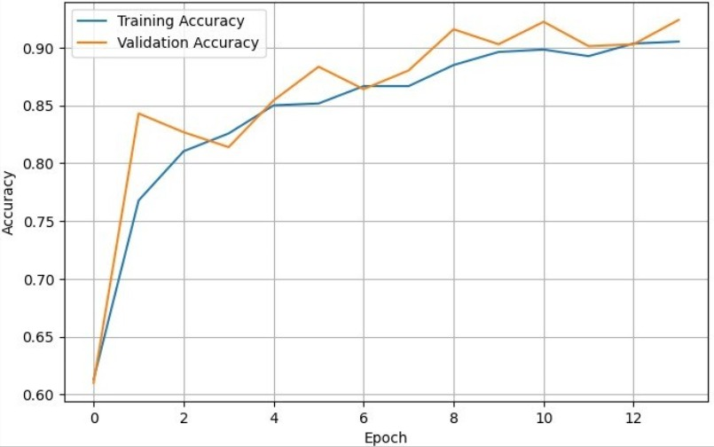
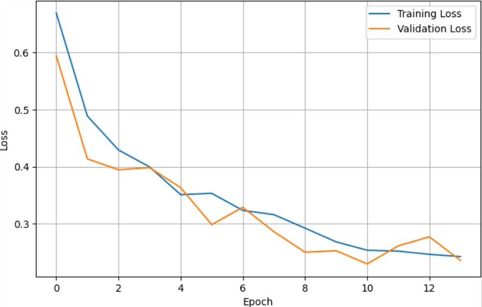

# Siren Sound Detection Using Convolutional Neural Networks

## Project Overview

This project presents a deep learning-based siren sound detection system developed as part of a graduation project focused on assistive technologies for individuals with disabilities.

The primary objective is to automatically detect emergency vehicle siren sounds and increase environmental awareness, particularly for hearing-impaired individuals.

The system classifies audio recordings into two categories:

- Siren
- Non-Siren

## Dataset Construction

A custom dataset was created by combining multiple publicly available audio sources:

- UrbanSound8K
- AudioSet
- Emergency Vehicle Siren Sounds Dataset

Siren and non-siren audio samples were collected, balanced, and prepared for training. Non-siren samples primarily consisted of environmental and traffic sounds.

## Audio Preprocessing

Audio files were processed using Librosa.

Preprocessing pipeline:

- Resampling to 16 kHz
- Mono conversion
- Fixed 4-second audio segments
- Log-Mel spectrogram extraction
- Feature normalization

The resulting Log-Mel spectrograms were used as input to the CNN model.

## Model Architecture

The model was implemented using TensorFlow/Keras.

Architecture:

- Conv2D (32 filters)
- MaxPooling2D
- Conv2D (64 filters)
- MaxPooling2D
- Conv2D (128 filters)
- MaxPooling2D
- GlobalAveragePooling2D
- Dense (128 neurons)
- Dropout (0.3)
- Sigmoid Output Layer

## Training Configuration

- Optimizer: Adam
- Loss Function: Binary Crossentropy
- Batch Size: 32
- Early Stopping: Enabled (Patience = 3)
- Validation Split: 20%

Threshold optimization was performed using F1-score analysis to determine the most suitable classification threshold.

## Results

The trained model achieved approximately **93% classification accuracy** on the evaluation dataset.

The model successfully distinguished siren sounds from non-siren environmental sounds under different recording conditions, demonstrating its effectiveness for real-time emergency awareness applications.

## Technologies Used

- Python
- TensorFlow / Keras
- Librosa
- NumPy
- Pandas
- Scikit-Learn
- Matplotlib
- Flask

## Deployment

The trained model was deployed as a Flask API on Render Cloud Platform and integrated into an ESP32-C3 based emergency notification device.

Audio data captured through the INMP441 digital MEMS microphone and processed by the ESP32-C3 is transmitted to the cloud-hosted API, where the CNN model performs siren/non-siren classification. The prediction result is then returned to the ESP32-C3 device in real time, enabling immediate user feedback through the onboard notification system.

## Future Improvements

- Multi-class emergency sound classification
- Larger and more diverse datasets
- Edge AI deployment and optimization
- Real-time streaming audio analysis

 ## Visual Results

### CNN Model Architecture

### System Architecture

### Confusion Matrix

### Training Accuracy

### Training Loss

## Author

**Gizem Yalçın**  
Computer Engineer
